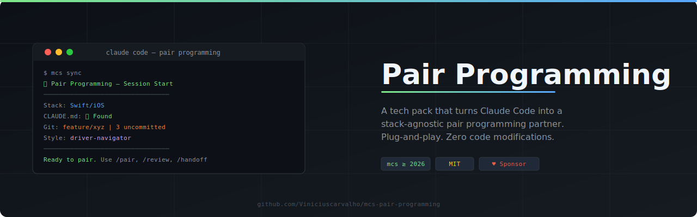

# Pair Programming 🤝 — Claude Code as your pair programmer.



[](https://github.com/bguidolim/mcs)
[](https://opensource.org/licenses/MIT)
[](https://claude.ai/code)
[](https://github.com/sponsors/Viniciuscarvalho)

A [tech pack](https://github.com/bguidolim/mcs) that turns Claude Code into a **stack-agnostic pair programming partner** — plug-and-play, zero code modifications required.

Built for the [`mcs`](https://github.com/bguidolim/mcs) configuration engine.

```
identifier: mcs-pair-programming
requires:   mcs >= 2026.2.28
```

---

## The Problem

Claude Code is powerful, but without structure it defaults to "do whatever the developer asks". Pair programming requires discipline: clear roles, review gates, convention enforcement, and session continuity. Setting this up manually for every project and every stack is tedious.

## The Solution

This pack provides a **complete pair programming framework** that:

- **Auto-detects your stack** — Swift, TypeScript, Python, Rust, Go, Kotlin, Ruby, .NET, and more
- **Reads your CLAUDE.md** — treats it as the source of truth for all conventions
- **Enforces pairing discipline** — three modes (driver-navigator, ping-pong, mob) with clear role boundaries
- **Runs review gates** — universal + stack-specific checklists before every commit
- **Maintains session continuity** — structured handoffs so the next session picks up seamlessly

**Zero modifications to your code.** Just `mcs sync` and start pairing.

---

## What's Included

### Skill

| Skill | Description |
|-------|-------------|
| **pair-programming** | Core workflow: stack detection, CLAUDE.md integration, role behavior, review protocol |

### Session Hooks

| Hook | Event | What It Does |
|------|-------|--------------|
| **session-context.sh** | `SessionStart` | Detects stack, checks CLAUDE.md, prints pairing context |
| **pair-review-gate.sh** | `UserPromptSubmit` | Reminds to review when commit/push language is detected |

### Slash Commands

| Command | Description |
|---------|-------------|
| `/pair [style]` | Switch between driver-navigator, ping-pong, mob |
| `/review` | Full pair review checklist against current changes |
| `/handoff` | Generate session summary for continuity |

### Templates (CLAUDE.local.md)

| Section | Instructions |
|---------|-------------|
| **pair-programming** | Core pairing rules, role, strictness, available commands |

### Settings

| Setting | Value | Purpose |
|---------|-------|---------|
| `defaultMode` | `plan` | Claude asks before making changes |
| `alwaysThinkingEnabled` | `true` | Extended reasoning for thoughtful pairing |

---

## Quick Start

```bash
# 1. Install mcs (if not already)
brew install bguidolim/tap/managed-claude-stack

# 2. Add this pack
mcs pack add Viniciuscarvalho/mcs-pair-programming

# 3. Go to your project and sync
cd ~/Developer/your-project
mcs sync

# 4. Verify
mcs doctor
```

`mcs sync` will ask you 3 questions:

| Prompt | What It Configures | Default |
|--------|--------------------|---------|
| **Your role** | How Claude addresses you | `Developer` |
| **Pairing style** | Default pairing mode | `driver-navigator` |
| **Review strictness** | How strict the review gate is | `standard` |

That's it. Open Claude Code in your project — the `SessionStart` hook runs automatically and you'll see:

```
🤝 Pair Programming — Session Start
━━━━━━━━━━━━━━━━━━━━━━━━━━━━━━━━━━━━
Stack:     Swift/iOS
CLAUDE.md: ✅ Found (project root)
Git:       Branch: feature/xyz | Uncommitted changes: 3
Style:     driver-navigator (use /pair to switch)
━━━━━━━━━━━━━━━━━━━━━━━━━━━━━━━━━━━━
```

You're ready to pair.

---

## Pairing Styles

### Driver-Navigator (default)
You code, Claude watches. Claude flags issues, suggests improvements, and catches edge cases without writing code unless asked.

### Ping-Pong
You alternate turns. Great for TDD — you write a failing test, Claude writes the implementation, repeat.

### Mob
Full collaboration. Both contribute code and design decisions. Best for spikes, architecture sessions, and boilerplate.

Switch anytime with `/pair <style>`.

---

## CLAUDE.md Integration

This pack treats `CLAUDE.md` as the **single source of truth**. Everything Claude does during pairing respects your project's conventions:

- Code generation follows your architecture patterns
- Reviews flag violations of your specific rules
- Suggestions align with your preferred libraries and tools

**No CLAUDE.md?** Claude uses language/framework best practices and suggests creating one.

---

## Stack Support

Auto-detected with stack-specific review checklists:

| Stack | Detection | Checklist Items |
|-------|-----------|-----------------|
| Swift/iOS | `Package.swift` | Force unwraps, retain cycles, accessibility, SwiftUI |
| TypeScript/React | `package.json` | Types, hooks rules, bundle size, ESLint |
| Python | `pyproject.toml` | Type hints, error handling, async, pytest |
| Rust | `Cargo.toml` | unwrap(), clippy, lifetimes, unsafe |
| Go | `go.mod` | Error handling, goroutine leaks, interfaces |
| Kotlin/JVM | `build.gradle` | Nullability, coroutines, sealed classes |
| Ruby | `Gemfile` | N+1 queries, RuboCop, service objects |
| .NET/C# | `*.csproj` | Nullable refs, async/await, DI |

**Other stacks:** Claude applies the universal checklist and adapts.

---

## Directory Structure

```
mcs-pair-programming/
├── techpack.yaml                              # Manifest
├── config/
│   └── settings.json                          # Plan mode + extended thinking
├── hooks/
│   ├── session-context.sh                     # Stack detection + context
│   └── pair-review-gate.sh                    # Pre-commit review reminder
├── commands/
│   ├── pair.md                                # /pair command
│   ├── review.md                              # /review command
│   └── handoff.md                             # /handoff command
├── skills/
│   └── pair-programming/
│       ├── SKILL.md                           # Core pair programming skill
│       └── references/
│           ├── stack-checklists.md            # Per-stack review gates
│           └── pairing-patterns.md            # Workflow patterns per style
└── templates/
    └── pair-programming.md                    # CLAUDE.local.md instructions
```

---

## Customization Points

This pack is designed to work out-of-the-box, but you can customize by:

1. **CLAUDE.md** — add project-specific conventions (the pack reads them automatically)
2. **`mcs sync` prompts** — change role, style, and strictness per project
3. **Fork and extend** — add new stack checklists, commands, or hooks

---

## Works Great With

| Pack | Why |
|------|-----|
| [mcs-core-pack](https://github.com/bguidolim/mcs-core-pack) | Git workflows, Serena code navigation, baseline settings |
| [mcs-continuous-learning](https://github.com/bguidolim/mcs-continuous-learning) | Persistent memory across sessions |

---

## License

MIT
